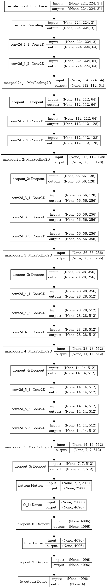
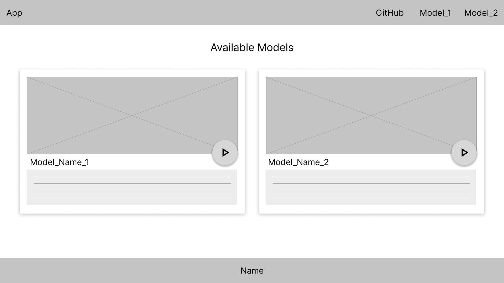
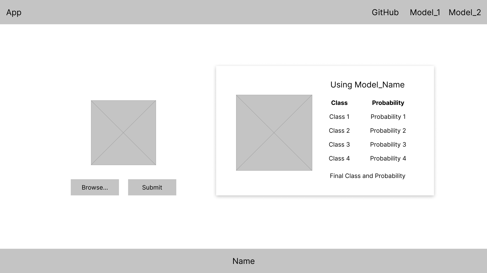
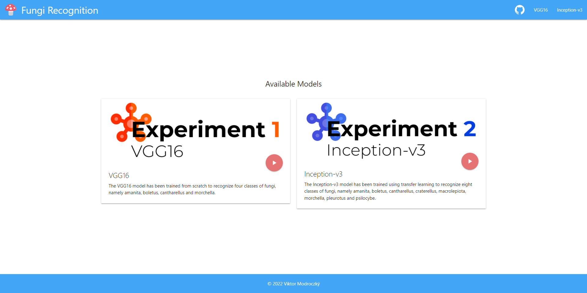
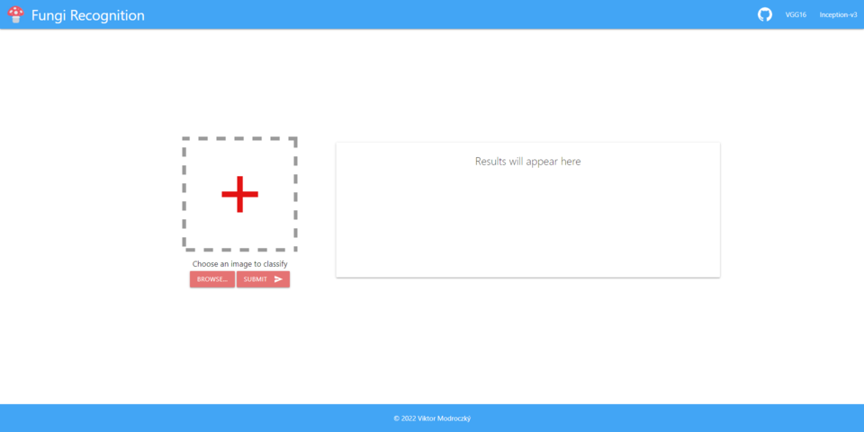
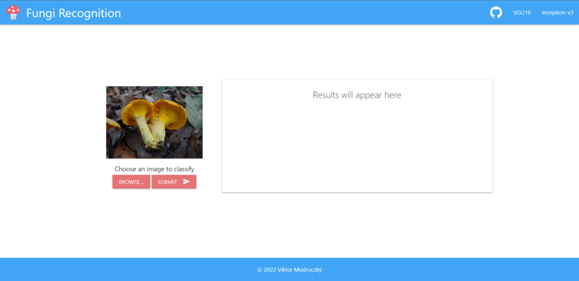
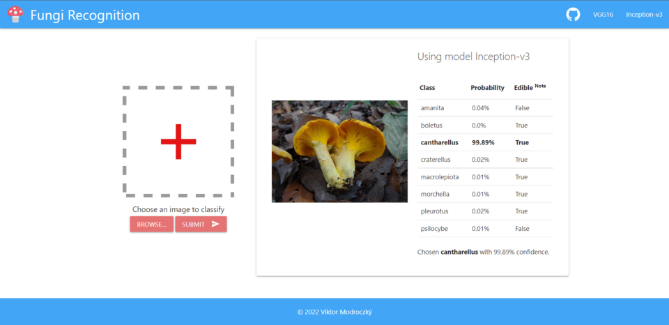

# Bakalárska práca [](./LICENSE)

Poznámky k práci sú v sekcii [**Poznámky**](#poznámky).

## Zapuzdrené prostredie pre spracovanie obrázkov na rozpoznávanie húb

Autor: Viktor Modroczký\
Vedúci práce: Ing. Giang Nguyen Thu, PhD.

### Zadanie

Zapuzdrené prostredie (angl. containerization) je dnes kritickým prvkom pre vývoj softvéru. Jeho použitie
umožňuje vybudovať inteligentné aplikácie od prototypu k nasadeniu pohodlne a časovo efektívne.
Momentálne, najpopulárnejší typ inteligentnej aplikácie je spracovanie obrázkov pomocou konvolučných
neurónových sietí (CNN). Analyzujte súčasný stav kontajnerizácie softvérov a spracovania obrázkov pomocou
CNN. Trénujte inteligentný model na rozpoznávanie húb (jedlé a jedovaté) na základe fotografií z Google
Images alebo z iných verejne dostupných zdrojov. Ako praktickú ukážku vybudovania zapuzdreného
prostredia, vytvorte docker kontajner s aplikáciou pre dátovú vedu. Z vytrénovaného modelu realizujte flask
aplikáciu na vizualizáciu. Vyhodnoťte výsledný softvérový produkt vrátane kvality vytvoreného modelu.

## Implementácia

### Technológie

#### Jazyky

[](https://docs.python.org/3/)
[](https://developer.mozilla.org/en-US/docs/Glossary/HTML5)
[](https://developer.mozilla.org/en-US/docs/Web/CSS)

#### Nasadenie

[](https://docs.docker.com/)
[](https://flask.palletsprojects.com/en/2.1.x/)

#### ML a DL knižnice

[](https://www.tensorflow.org/api_docs/python/tf)
[](https://keras.io/api/)
[](https://scikit-learn.org/stable/modules/classes.html)

### Datasety

Dataset pre trénovanie a testovanie modelu VGG16 je dostupný na [odkaze](https://drive.google.com/drive/folders/1i9dmyGbAPThS8vpjOmS-O0nVpHewVlCs?usp=sharing).\
Dataset pre trénovanie a testovanie modelu Inception-v3 je dostupný na [odkaze](https://drive.google.com/drive/folders/1f8j69UsWv_Csc3vQJ0AdOL05mYAiv-t2?usp=sharing).

#### Zdroje

- [FGVCx Fungi Classification Challenge](https://github.com/visipedia/fgvcx_fungi_comp#data)
- [Mushroom Observer](https://mushroomobserver.org/articles/20)

### Modely

#### VGG16

Model **VGG16** natrénovaný v prvom experimente je dostupný na [odkaze](https://drive.google.com/uc?id=1lRNyWJWmEYHFquGfqqPcqXrSVANk0jJW).

#### Inception-v3

Model **Inception-v3** natrénovaný v druhom experimente je dostupný na [odkaze](https://drive.google.com/uc?id=12mCiBrNAvLkslWfrG0XckJp_OlboyEcr).

### Docker

Na vytvorenie Docker obrazu je potrebné vykonať príkaz

```shell
docker-compose build
```

Na spustenie aplikácie s kontajnerom je potrebné vykonať príkaz

```shell
docker-compose -p <app_name> up -d
```

Na zastavenie kontajneru aplikácie je potrebné vykonať príkaz

```shell
docker-compose -p <app_name> stop
```

### Skripty

#### Skript pre získanie obrázkov do trénovacieho a testovacieho datasetu

```shell
python obtain.py <path/to/json/file>
```

Príklad metadát v json súbore pre skript [obtain.py](./src/scripts/obtain.py):

```json
{
    "tsv_path": "path/to/mushroom/observer/tsv/file",
    "dl_path": "path/to/download/folder",
    "authors_path": "path/to/save/author/names",
    "queries": [
        "amanita",
        "boletus",
        "cantharellus",
        "morchella",
        "macrolepiota",
        "craterellus",
        "pleurotus",
        "psilocybe"
    ],
    "limit": 3000
}
```

`tsv_path` je umiestnenie súboru [tsv](https://drive.google.com/file/d/1fPXJtJpqiQEQb1ezINdFK-Jhee84DvMA/view?usp=sharing), ktorý obsahuje zoznam obrázkov húb z Mushroom Observer.\
`dl_path` je priečinok, do ktorého sa majú obrázky sťahovať.\
`authors_path` je priečinok, do ktorého sa má uložiť textový súbor s menami autorov obrázkov.\
`queries` je zoznam názvov húb, ktoré sa majú stiahnuť.\
`limit` je maximálny počet obrázkov, ktorý sa má stiahnuť pre jeden typ huby.

#### Skript pre rozšírenie trénovacieho datasetu

```shell
python augment.py <path/to/json/file>
```

Príklad metadát v json súbore pre skript [augment.py](./src/scripts/augment.py):

```json
{
    "img_size": 299,
    "classes": {
        "train": {
            "amanita": 58,
            "boletus": 48,
            "cantharellus": 49,
            "morchella": 46,
            "macrolepiota": 97,
            "craterellus": 55,
            "pleurotus": 34,
            "psilocybe": 80
        },
        "test": {
            "amanita": 6,
            "boletus": 8,
            "cantharellus": 7,
            "morchella": 7,
            "macrolepiota": 8,
            "craterellus": 7,
            "pleurotus": 6,
            "psilocybe": 7
        }
    },
    "data_path": "path/to/dataset/to/be/augmented",
    "augmented_data_path": "path/to/store/augmented/dataset"
}
```

`img_size` je veľkosť výstupných obrázkov.\
`classes` je zoznam tried v trénovacom a testovacom priečinku pre klasifikáciu spolu s číslom, ktoré hovorí, koľkokrát sa má každý obrázok v danej triede rozšíriť. Ak sa uvedie iba zoznam pre trénovací alebo testovací dataset, tak rozširovanie prebehne len pre uvedený dataset.\
`data_path` je umiestnenie trénovacieho ($data_path/train) a testovacieho datasetu ($data_path/test).\
`augmented_data_path` je nové umiestnenie rozšíreného testovacieho datasetu ($augmented_data_path/test) a trénovacieho datasetu ($augmented_data_path/train).

### Experiment 1 s modelom VGG16

Notebook [vgg16.ipynb](src/notebooks/vgg16.ipynb) na trénovanie a testovanie modelu VGG16 bol spúšťaný na platforme [Kaggle](https://www.kaggle.com/viktormodroczky/vgg16-for-fungi-classification/notebook).

<details>
<summary><b>Vybudovaný model VGG16 pomocou Keras</b></summary>



</details>

### Experiment 2 s modelom Inception-v3 a preneseným učením

Notebook [inception_v3.ipynb](src/notebooks/inception_v3.ipynb) na trénovanie a testovanie modelu Inception-v3 bol spúšťaný na platforme [Kaggle](https://www.kaggle.com/viktormodroczky/inception-v3-for-fungi-classification/notebook).

### Webová aplikácia

#### Návrh používateľského rozhrania

<details>
<summary><b>Zobraziť návrh</b></summary>





</details>

#### Finálne používateľské rozhranie

Používateľské rozhranie je implementované pomocou CSS rámca [Materialize](https://materializecss.com/) <a href="https://materializecss.com/"></a>.

<details>
<summary><b>Zobraziť finálne rozhranie</b></summary>









</details>

#### Endpointy

##### Endpoint pre hlavnú stránku

```http
host/
```

##### Endpoint pre VGG16 model

```http
host/vgg16
```

##### Endpoint pre Inception-v3 model

```http
host/inception-v3
```

### Poznámky

Po vykonaní prvého experimetu bola objavená chyba v kóde pri vytváraní matíc zámen. Išlo o vymenené označenie osi *x* a *y*.\
**Chyba bola opravená nasledovne:**

kód

```python
plt.xlabel('True Classes')
plt.ylabel('Predicted Classes')
```

sa upravil na kód

```python
plt.xlabel('Predicted Classes')
plt.ylabel('True Classes')
```
