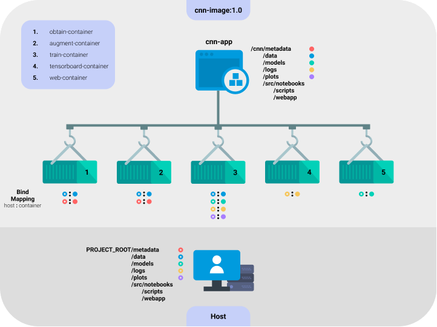
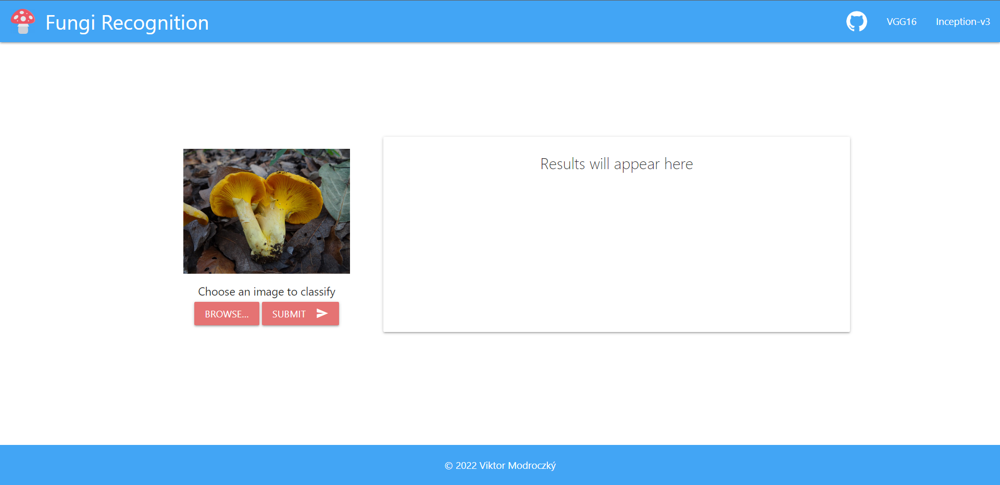

# Bakalárska práca [](./LICENSE)

Poznámky k práci sú v sekcii [**Poznámky**](#poznámky).

## Zapuzdrené prostredie pre spracovanie obrázkov na rozpoznávanie húb

Autor: Viktor Modroczký\
Vedúci práce: Ing. Giang Nguyen Thu, PhD.

### Zadanie

Zapuzdrené prostredie (angl. containerization) je dnes kritickým prvkom pre vývoj softvéru. Jeho použitie
umožňuje vybudovať inteligentné aplikácie od prototypu k nasadeniu pohodlne a časovo efektívne.
Momentálne, najpopulárnejší typ inteligentnej aplikácie je spracovanie obrázkov pomocou konvolučných
neurónových sietí (CNN). Analyzujte súčasný stav kontajnerizácie softvérov a spracovania obrázkov pomocou
CNN. Trénujte inteligentný model na rozpoznávanie húb (jedlé a jedovaté) na základe fotografií z Google
Images alebo z iných verejne dostupných zdrojov. Ako praktickú ukážku vybudovania zapuzdreného
prostredia, vytvorte docker kontajner s aplikáciou pre dátovú vedu. Z vytrénovaného modelu realizujte flask
aplikáciu na vizualizáciu. Vyhodnoťte výsledný softvérový produkt vrátane kvality vytvoreného modelu.

## Implementácia

### Technológie

#### Jazyky

[](https://docs.python.org/3/)
[](https://developer.mozilla.org/en-US/docs/Glossary/HTML5)
[](https://developer.mozilla.org/en-US/docs/Web/CSS)

#### Nasadenie

[](https://docs.docker.com/)
[](https://flask.palletsprojects.com/en/2.1.x/)

#### ML a DL knižnice

[](https://www.tensorflow.org/api_docs/python/tf)
[](https://keras.io/api/)
[](https://scikit-learn.org/stable/modules/classes.html)

### Datasety

Dataset pre trénovanie a testovanie modelu VGG16 je dostupný na [odkaze](https://drive.google.com/drive/folders/1i9dmyGbAPThS8vpjOmS-O0nVpHewVlCs?usp=sharing).\
Dataset pre trénovanie a testovanie modelu Inception-v3 je dostupný na [odkaze](https://drive.google.com/drive/folders/1f8j69UsWv_Csc3vQJ0AdOL05mYAiv-t2?usp=sharing).

#### Zdroje

- [FGVCx Fungi Classification Challenge](https://github.com/visipedia/fgvcx_fungi_comp#data)
- [Mushroom Observer](https://mushroomobserver.org/articles/20)

### Modely

#### VGG16

Model **VGG16** natrénovaný v prvom experimente je dostupný na [odkaze](https://drive.google.com/uc?id=14azWroG6dg9Kws4D6KJA4j4pVyGxuk0I).

#### Inception-v3

Model **Inception-v3** natrénovaný v druhom experimente je dostupný na [odkaze](https://drive.google.com/uc?id=1vsENg88g9YI9ZiWeVveIIMPvwWTNvdRv).

### Docker

Použité verzie:

Docker version 20.10.14, build a224086\
Docker Compose version v2.4.1

#### Diagram navrhnutého riešenia



V súbore `.env` v koreňovom adresári projektu je možné nastaviť niekoľko voliteľných premenných prostredia, a to:

1. `CNN_GUNICORN_PORT` - port, na ktorom beží webová aplikácia. Predvolená hodnota je port `5000`.
2. `CNN_GUNICORN_THREADS` - počet vlákien na spracúvanie požiadaviek na webovú aplikáciu. Predvolená hodnota je `8`.
3. `CNN_OBTAIN_JSON` - názov JSON súboru v adresári `metadata`, v ktorom sú uložené metadáta k získavaniu dát.
Predvolená hodnota je `obtain.json`.
4. `CNN_AUGMENT_JSON` - názov JSON súboru v adresári `metadata`, v ktorom sú uložené metadáta k rozširovaniu dát.
Predvolená hodnota je `augment.json`.
5. `CNN_NOTEBOOK_PORT` - port, na ktorom beží Jupyter Notebook na trénovanie a testovanie. Predvolená hodnota je port `5001`.
6. `CNN_TENSORBOARD_PORT` - port, na ktorom beží Tensorboard na sledovanie trénovania. Predvolená hodnota je port `5002`.

Príklad `.env` súboru:

```env
CNN_GUNICORN_PORT=1111
CNN_GUNICORN_THREADS=16
CNN_OBTAIN_JSON=my_obtain.json
CNN_AUGMENT_JSON=my_augment.json
CNN_NOTEBOOK_PORT=2222
CNN_TENSORBOARD_PORT=3333
```

Na vytvorenie Docker obrazu je potrebné vykonať príkaz

```shell
docker-compose build
```

Na spustenie aplikácie s kontajnerom služby je potrebné vykonať príkaz

```shell
docker-compose -p cnn-app up -d {service_name}
```

Parameter `{service_name}` môže byť jedna zo služieb `obtain`, `augment`, `train`, `tensorboard` alebo `web`.\
Výpisy je potom možné vypísať alebo sledovať pomocou príkazu

```shell
docker logs [--follow] {service_container}
```

Parameter `{service_container}` je jeden z kontajnerov služby `obtain-container`, `augment-container`, `train-container`, `tensorboard-container` alebo `web-container`. Prepínač `--follow` zapne sledovanie všetkých nových výpisov kontajneru, čiže sa vypíšu doterajšie výpisy a budú sa aj naďalej sledovať.

Na zastavenie kontajnerov aplikácie je potrebné vykonať príkaz

```shell
docker-compose -p cnn-app stop
```

alebo

```shell
docker-compose -p cnn-app down
```

na zastavenie a vymazanie kontajnerov a aplikácie.\
Prepínač `-p` nastavuje názov projektu, resp aplikácie a prepínač `-d` spúšťa kontajnery v tzv. detached móde, čiže v pozadí.

**Pred spúšťamín služieb si prečítajte nasledovné časti:**

1. [Nastavenia pre skripty spúšťané v službách obtain a augment](#nastavenia-pre-skripty-spúšťané-v-službách-obtain-a-augment)
2. [Služby train a tensorboard](#služby-train-a-tensorboard)
3. [Služba web](#služba-web)

### Nastavenia pre skripty spúšťané v službách obtain a augment

**Všetky cesty v JSON súboroch sa musia uvádzať relatívne ku koreňovému priečinku projektu. Aby boli cesty viditeľné pre kontajnery, je nutné, aby cesty smerovali do priečinka `data`.**

#### Skript pre získanie obrázkov do trénovacieho a testovacieho datasetu

Tento skript je automaticky spúšťaný službou `obtain`. Pred jej spustením je potrebné nastaviť metadáta v JSON súbore v priečinku `metadata`.
Príklad metadát v JSON súbore `obtain.json` pre skript [obtain.py](./src/scripts/obtain.py):

```json
{
    "tsv_path": "data/mushroom_observer.tsv",
    "dl_path": "data/path/to/download/folder",
    "authors_path": "data/path/to/save/author/names",
    "queries": [
        "amanita",
        "boletus",
        "cantharellus",
        "morchella",
        "macrolepiota",
        "craterellus",
        "pleurotus",
        "psilocybe"
    ],
    "limit": 3000
}
```

`tsv_path` je umiestnenie súboru [tsv](https://drive.google.com/file/d/1fPXJtJpqiQEQb1ezINdFK-Jhee84DvMA/view?usp=sharing), ktorý obsahuje zoznam obrázkov húb z Mushroom Observer. Súbor `mushroom_observer.tsv` je predvolene umiestnený v `data/mushroom_observer.tsv`.\
`dl_path` je priečinok, do ktorého sa majú obrázky sťahovať.\
`authors_path` je priečinok, do ktorého sa majú uložiť textové súbory s menami autorov obrázkov pre jednotlivé druhy húb.\
`queries` je zoznam názvov húb, ktoré sa majú stiahnuť.\
`limit` je maximálny počet obrázkov, ktorý sa má stiahnuť pre jeden typ huby.

#### Skript pre rozšírenie trénovacieho datasetu

Tento skript je automaticky spúšťaný službou `augment`. Pred jej spustením je potrebné nastaviť metadáta v JSON súbore v priečinku `metadata`.
Príklad metadát v JSON súbore `augment.json` pre skript [augment.py](./src/scripts/augment.py):

```json
{
    "img_size": 299,
    "classes": {
        "train": {
            "amanita": 58,
            "boletus": 48,
            "cantharellus": 49,
            "morchella": 46,
            "macrolepiota": 97,
            "craterellus": 55,
            "pleurotus": 34,
            "psilocybe": 80
        },
        "test": {
            "amanita": 6,
            "boletus": 8,
            "cantharellus": 7,
            "morchella": 7,
            "macrolepiota": 8,
            "craterellus": 7,
            "pleurotus": 6,
            "psilocybe": 7
        }
    },
    "data_path": "data/path/to/dataset/to/be/augmented",
    "augmented_data_path": "data/path/to/store/augmented/dataset"
}
```

`img_size` je veľkosť výstupných obrázkov.\
`classes` je zoznam tried v trénovacom a testovacom priečinku pre klasifikáciu spolu s číslom, ktoré hovorí, koľkokrát sa má každý obrázok v danej triede rozšíriť. Ak sa uvedie iba zoznam pre trénovací alebo testovací dataset, tak rozširovanie prebehne len pre uvedený dataset.\
`data_path` je umiestnenie trénovacieho ($data_path/train) a testovacieho datasetu ($data_path/test).\
`augmented_data_path` je nové umiestnenie rozšíreného trénovacieho datasetu ($augmented_data_path/train) a testovacieho datasetu ($augmented_data_path/test).

Spustenie skriptov mimo Docker kontajneru:

```shell
python obtain.py {json_name}
```

```shell
python augment.py {json_name}
```

`{json_name}` je meno JSON súboru v priečinku `metadata` v koreňovom adresári projektu.

### Služby train a tensorboard

Služba `train` spúšťa Jupyter notebook na písanie notebookov pre trénovanie alebo testovanie modelov. Spustenie služby `train` automaticky vytvorí priečinok `plots` pre ukladanie akýchkoľvek grafov z trénovania alebo testovania z notebookov.\
Služba `tensorboard` spúšťa aplikáciu Tensorboard na sledovanie trénovania pomocou logov v priečinku `logs`, ktorý sa vytvára automaticky po spustení služby v prípade, že neexistuje.

### Služba web

Spustenie webovej aplikácie ako kontajnerizovanej služby `web` vyžaduje prítomnosť modelov vo forme súborov [`vgg16.h5`](https://drive.google.com/uc?id=14azWroG6dg9Kws4D6KJA4j4pVyGxuk0I) a [`inception_v3.h5`](https://drive.google.com/uc?id=1vsENg88g9YI9ZiWeVveIIMPvwWTNvdRv) v priečinku `models` v koreňovom adresári projektu.\
Podrobnosti o webovej aplikácii sú v sekcii [Webová aplikácia](#webová-aplikácia).

### Experiment 1 s modelom VGG16

Notebook [vgg16.ipynb](src/notebooks/vgg16.ipynb) na trénovanie a testovanie modelu VGG16 bol spúšťaný na platforme [Kaggle](https://www.kaggle.com/viktormodroczky/vgg16-for-fungi-classification/notebook) - aktuálna verzia je v29.

<details>
<summary><b>Vybudovaný model VGG16 pomocou Keras</b></summary>


</details>

### Experiment 2 s modelom Inception-v3 a preneseným učením

Notebook [inception_v3.ipynb](src/notebooks/inception_v3.ipynb) na trénovanie a testovanie modelu Inception-v3 bol spúšťaný na platforme [Kaggle](https://www.kaggle.com/viktormodroczky/inception-v3-for-fungi-classification/notebook) - aktuálna verzia je v49.

### Webová aplikácia

#### Návrh používateľského rozhrania

<details>
<summary><b>Zobraziť návrh</b></summary>


</details>

#### Finálne používateľské rozhranie

Používateľské rozhranie je implementované pomocou CSS rámca [Materialize](https://materializecss.com/) <a href="https://materializecss.com/"></a>.

<details>
<summary><b>Zobraziť finálne rozhranie</b></summary>





</details>

#### Endpointy

##### Endpoint pre hlavnú stránku

```http
host:port/
```

##### Endpoint pre VGG16 model

```http
host:port/vgg16
```

##### Endpoint pre Inception-v3 model

```http
host:port/inception-v3
```

### Poznámky

Po vykonaní prvého experimetu bola objavená chyba v kóde pri vytváraní matíc zámen. Išlo o vymenené označenie osi *x* a *y*.\
**Chyba bola opravená nasledovne:**

kód

```python
plt.xlabel('True Classes')
plt.ylabel('Predicted Classes')
```

sa upravil na kód

```python
plt.xlabel('Predicted Classes')
plt.ylabel('True Classes')
```
